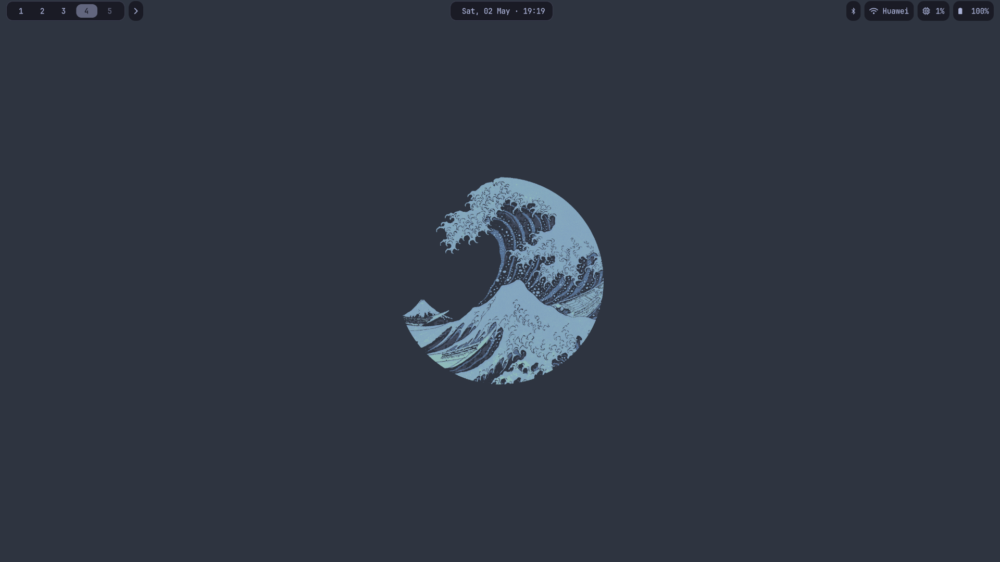

# Omarchy OS Dotfiles

Personal configuration files for Omarchy OS (Arch Linux-based Hyprland distribution).

## Overview

These dotfiles contain customizations made from the default Omarchy OS configuration. Omarchy uses a system where defaults are sourced from `~/.local/share/omarchy/default/` and user customizations override them.

## Contents

- **Waybar**: Custom top bar configuration with modules for workspaces, clock, date, system info, and notifications.
- **Hyprland**: Window manager configurations including keybindings, monitor settings, idle management, and visual effects.
- **Starship**: Shell prompt customization for a clean and informative terminal experience.
- **Do**: A small task-capture popup, opened with `Super + D` or the ✓ in the bar. See below.

## Do — task popup

A single-file GTK4 task list that drops out of the top-right corner of the bar.
It draws itself as a `wlr-layer-shell` overlay, so it never tiles and never
takes a workspace.

| File | Purpose |
| --- | --- |
| `home/.local/bin/do` | Launcher. Toggles the popup over D-Bus; starts it on demand. `todo` is an alias symlink. |
| `home/.local/lib/do/do.py` | The application itself. |
| `home/.local/lib/do/style.css` | Its dark theme. |
| `.config/hypr/bindings.conf` | `Super + D` opens it. |
| `.config/hypr/autostart.conf` | Keeps it resident, so opening is instant. |
| `.config/waybar/{config.jsonc,style.css}` | The ✓ button in the bar. |

Usage:

```bash
do              # toggle the popup
do show | hide  # explicit
do --daemon     # start resident, stay hidden (what Hyprland autostart runs)
do --quit       # stop the resident process
```

Inside the popup: type and press `Enter` to add, `↑`/`↓` to move, `Space` to
complete, `Enter` to rename, `Delete` to remove, `Esc` to close.

Tasks are stored as JSON in `~/.local/share/do/tasks.json` — that is your own
data, so it lives outside this repository and is never overwritten by the
install script.

Requires `gtk4`, `gtk4-layer-shell` and `python-gobject`; `install.sh` tells you
if any are missing.




*Representation of the lovely Waybar and wallpaper setup.*

## Installation

To apply these configurations to your system:

1. Clone this repository:
   ```bash
   git clone https://github.com/yourusername/dotfiles-arch.git
   cd dotfiles-arch
   ```

2. Run the install script:
   ```bash
   ./install.sh
   ```

The script will copy the configuration files to their appropriate locations. You may need to restart Hyprland or reload configurations for changes to take effect.
